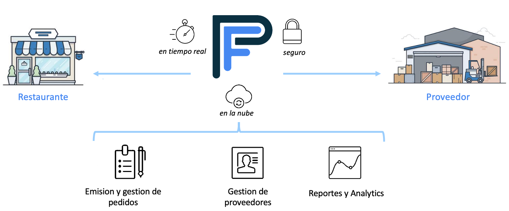
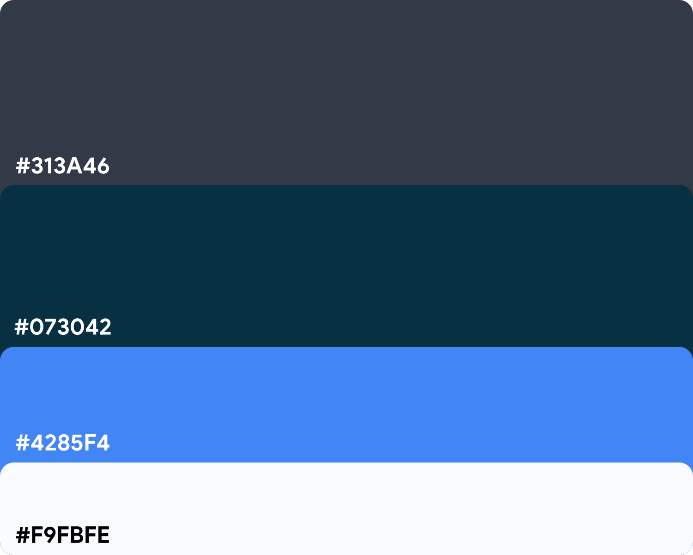

  

# Bienvenidos
Pedí Fácil es una plataforma de gestión de pedidos creada para optimizar, modernizar y agilizar el proceso de compra en la industria gastronómica. 

# Problema

* ## Restaurantes

    - Un restaurante promedio tiene entre 15 y 20 proveedores diferentes.

    - Cada proveedor tiene una vía diferente para recibir sus órdenes de
      compra (email, teléfono, WhatsApp, etc).

    - Todos los días, al final del turno, el encargado de compras dedica, en
      promedio, una hora y cuarto a realizar los pedidos para el día siguiente.

    - Al día siguiente, se vuelve a contactar al proveedor para asegurarse de
      que recibió correctamente la orden de compra.

 

* # Proveedores

    - Por otro lado, están los proveedores que reciben órdenes de compra
      por múltiples vías.

    - Deben procesarlas a tiempo para cumplir con la entrega.

    - Este mecanismo requiere mucho tiempo y es muy propenso a errores, lo
      cual genera mayores costos y menor rentabilidad.
 

<h4 align="center" style="display: inline" style="clear:none">... el problema es básicamente de <u>comunicación.</u></h4>

  <h2>Solución</h2>

      - Una aplicación que emite todas las órdenes de compras por una misma vía en una fracción del tiempo.

      - Permitiendo a todos los restaurantes, independientemente de su tamaño, acceder a las últimas herramientas
        y tecnologías.

      - Brindando una comunicación clara entre cliente y proveedor, que se traduce en menos pedidos devueltos y
        tiempos de respuesta de pedidos más rápidos.

      - Simplemente traemos orden al caos.

  

    
  

  <h2>Inspiración</h2>

  * <a href="https://www.bluecart.com" target="_blank">Bluecart</a> 

        - Por ser la plataforma de gestión de órdenes de compra líder en el mundo.

  * <a href="https://www.simpleorder.com" target="_blank">SimpleOrder</a> 

        - Por tener muy buena UI/UX.

  * <a href="https://www.marketman.com" target="_blank">Marketman</a> 

        - Por sus múltiples funcionalidades.

  * <a href="https://www.mercadolibre.com" target="_blank">MercadoLibre</a> 

        - Por el diseño y tipografía de la web.

  * <a href="https://www.robinhood.com" target="_blank">Robinhood</a> 

        - Por el diseño y colores de la web.

  <h2>Equipo</h2>

  
  > Germán Silva 
      - Futuro Full Stack Web Developer 
      - Estudiante de Lic. en Ciencias de la Computación 
  <h6></h6>
  
  > Rodrigo Espinosa 
      - sanata 
      - alguna otra sanata 
  <h6></h6>
  
  > Guillermo Gonzales 
      - Futuro Web Developer 
      - Linux enthusiast 
  <h6></h6>
  
  > Eduardo Andreu 
      - Lic. en Administración de Empresas 
      - 10 años de experiencia en la industria gastronómica 
  <h6></h6>

<h2>Diseño</h2>

  <h3>Tipografía</h3>
  * <a href="https://fonts.google.com/specimen/Lato" target="_blank">Lato</a> 
  * <a href="https://fonts.google.com/specimen/Montserrat" target="_blank">Montserrat</a>

  <h3>Paleta de colores</h3>
    