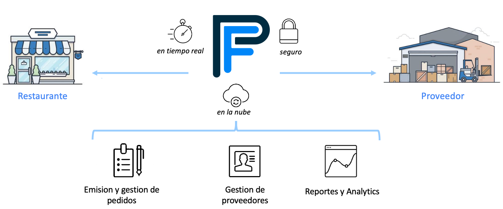
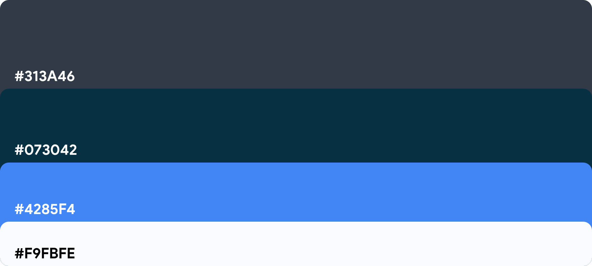

<p align="center">
  
</p>

**Pedí Fácil es una plataforma de gestión de pedidos creada para optimizar, modernizar y agilizar el proceso de compra en la industria gastronómica.**

# Problema

* #### Restaurantes


```
- Un restaurante promedio tiene entre 15 y 20 proveedores diferentes.

- Cada proveedor tiene una vía diferente para recibir sus órdenes de
  compra (email, teléfono, WhatsApp, etc).

- Todos los días, al final del turno, el encargado de compras dedica, en
  promedio, una hora y cuarto a realizar los pedidos para el día siguiente.

- Al día siguiente, se vuelve a contactar al proveedor para asegurarse de
  que recibió correctamente la orden de compra.
```

* #### Proveedores


```
- Por otro lado, están los proveedores que reciben órdenes de compra
  por múltiples vías.

- Deben procesarlas a tiempo para cumplir con la entrega.

- Este mecanismo requiere mucho tiempo y es muy propenso a errores, lo
  cual genera mayores costos y menor rentabilidad.
```

<div align="center"><br>...el problema es básicamente de <b>comunicación</b>.</div>

# Solución

- Una aplicación que emite todas las órdenes de compras por una misma vía en una fracción del tiempo.

- Permitiendo a todos los restaurantes, independientemente de su tamaño, acceder a las últimas herramientas
  y tecnologías.

- Brindando una comunicación clara entre cliente y proveedor, que se traduce en menos pedidos devueltos y
  tiempos de respuesta de pedidos más rápidos.

- Simplemente traemos orden al caos.

- En primera instancia, como beta funcional, simplificamos la plataforma para transformarla en un e-commerce tradicional simulando un único proveedor, pero siempre permitiendo la escalabilidad del proyecto para completar las funcionalidades planificadas desde el principio.



# Inspiración

* [BlueCart](https://www.bluecart.com)
  ```
  - Por ser la plataforma de gestión de órdenes de compra líder en el mundo
  ```
* [SimpleOrder](https://www.simpleorder.com)
  ```
  - Por tener muy buena UI/UX
  ```
* [MarketMan](https://www.marketman.com)
  ```
  - Por sus múltiples funcionalidades
  ```
* [Mercado Libre](https://www.mercadolibre.com)
  ```
  - Por el diseño y tipografía de la web
  ```
* [Extendeal](https://extendeal.com)
  ```
  - Plataforma de gestión de compras en latinoamerica
  ```

# Diseño

### Logo
* El mismo logo en diferentes colores dependiendo del color de fondo en el momento


### Wireframe & Mockups
* [Adobe XD link](https://xd.adobe.com/view/545bda9a-3633-4921-74ae-28f225b380b4-226a/)

### Tipografía
* [Montserrat](https://fonts.google.com/specimen/Montserrat)
* [Nunito](https://fonts.google.com/specimen/Nunito)

### Paleta de colores


# Tablero de trabajo (Trello)
* [Link Trello](https://trello.com/b/0qLG84ti/digital-house)

# Equipo


> Germán Silva<br>
- Futuro Full Stack Web Developer<br>
- Estudiante de Lic. en Ciencias de la Computación<br>
<h6></h6>

> Rodrigo Espinosa<br>
- Futuro Full Stack Developer<br>
- Desarrollador activo<br>
<h6></h6>

> Guillermo Gonzales<br>
- Futuro Web Developer<br>
- Linux enthusiast<br>
<h6></h6>

> Eduardo Andreu<br>
- Lic. en Administración de Empresas<br>
- 10 años de experiencia en la industria gastronómica<br>
