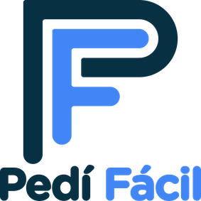
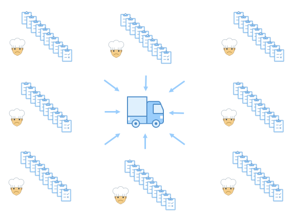

  

# Bienvenidos
> Pedifacil es una plataforma de gestión de pedidos creada para optimizar, modernizar y agilizar el proceso de compra en la industria gastronomica.

## Problema

<h2 align="left">* Restaurantes</h2>

    - un restaurante promedio tiene entre 15 y 20 proveedores diferentes.
    
    - cada proveedor tiene una via diferente para recibir sus ordenes de 
      compra (email, telefono, whatsapp, etc).
      
    - todas los dias, al final del turno, el encargado de compras dedica, en 
      promedio, una hora y cuarto a realizar los pedidos para el dia siguiente.

 
<h2 align="left">* Proveedores</h2>

    - por otro lado, estan los proveedores que reciben ordenes de compra 
      por multiples vias.
    
    - deben procesarlas a tiempo para cumplir con la entrega.
      
    - este mecanismo requiere mucho tiempo y es muy propenso a errores, lo 
      cual genera mayores costos y menor rentabilidad.
 
<h3 align="center">Hay un problema de comunicacion!</h3>

## Solucion

##### Simplemente traemos orden al caos!!!

Como lo hacemos?

Mediante una aplicacion que permite al restaurante realizar todos sus ordenes de compras por una misma via en una fraccion del tiempo.

## Screenshots

## Technologies
* Tech 1 - version 1.0
* Tech 2 - version 2.0
* Tech 3 - version 3.0

## Setup
Describe how to install / setup your local environement / add link to demo version.

## Code Examples
Show examples of usage:
`put-your-code-here`

## Features
List of features ready and TODOs for future development
* Awesome feature 1
* Awesome feature 2
* Awesome feature 3

To-do list:
* Wow improvement to be done 1
* Wow improvement to be done 2

## Status
Project is: _in progress_, _finished_, _no longer continue_ and why?

## Inspiration
Add here credits. Project inspired by..., based on...

## Contact
Created by [@flynerdpl](https://www.flynerd.pl/) - feel free to contact me!
