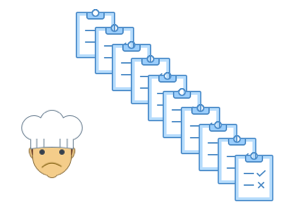

  

<h1>Bienvenidos</h1>
Pedifacil es una plataforma de gestión de pedidos creada para optimizar, modernizar y agilizar el proceso de compra en la industria gastronomica. 

<h2>Problema</h2>

<h3 align="left">* Restaurantes</h3>

    - un restaurante promedio tiene entre 15 y 20 proveedores diferentes.
    
    - cada proveedor tiene una via diferente para recibir sus ordenes de 
      compra (email, telefono, whatsapp, etc).
      
    - todas los dias, al final del turno, el encargado de compras dedica, en 
      promedio, una hora y cuarto a realizar los pedidos para el dia siguiente.

 
<h3 align="left">* Proveedores</h3>

    - por otro lado, estan los proveedores que reciben ordenes de compra 
      por multiples vias.
      
    - deben procesarlas a tiempo para cumplir con la entrega.
      
    - este mecanismo requiere mucho tiempo y es muy propenso a errores, lo 
      cual genera mayores costos y menor rentabilidad.
 

    <h2 style="float: left">Heading 1</h2>
    <h3 style="float: right">Heading 2</h3>

<h4 align="center" style="display: inline" style="clear:none">El problema es basicamente un problema de</h4> <h3 align="center" style="display: inline" style="clear:none"><em>COMUNICACION!!!</em></h2>

<h4 align="center">El problema es basicamente un problema de<h3></h4><em>COMUNICACION!!!</em></h3></h4>

<h2>Solucion</h2>

<h4>Simplemente traemos orden al caos!!!</h4>

Como lo hacemos? 

Mediante una aplicacion que permite al restaurante realizar todos sus ordenes de compras por una misma via en una fraccion del tiempo. 

<h2>Funcionalidades</h2>

<h2>Inspiracion</h2>
* <a href="https://www.bluecart.com" target="_blank">Bluecart</a> 
* <a href="https://www.simpleorder.com" target="_blank">SimpleOrder</a> 
* <a href="https://www.marketman.com" target="_blank">Marketman</a> 
* <a href="https://www.getorderly.com" target="_blank">Orderly</a> 
* <a href="https://www.robinhood.com" target="_blank">Robinhood</a> 

<h2>Equipo</h2>

  
  - Eduardo Andreu 
  - Lic. Administracion de Empresas 
  - alguna otra sanata 
  <h6></h6>
  
  - Eduardo Andreu 
  - Lic. Administracion de Empresas 
  - alguna otra sanata 
  <h6></h6>
  
  - Eduardo Andreu 
  - Lic. Administracion de Empresas 
  - alguna otra sanata 
  <h6></h6>
  
  - Eduardo Andreu 
  - Lic. Administracion de Empresas 
  - alguna otra sanata 
  <h6></h6>
  

<h2>Contacto</h2>
