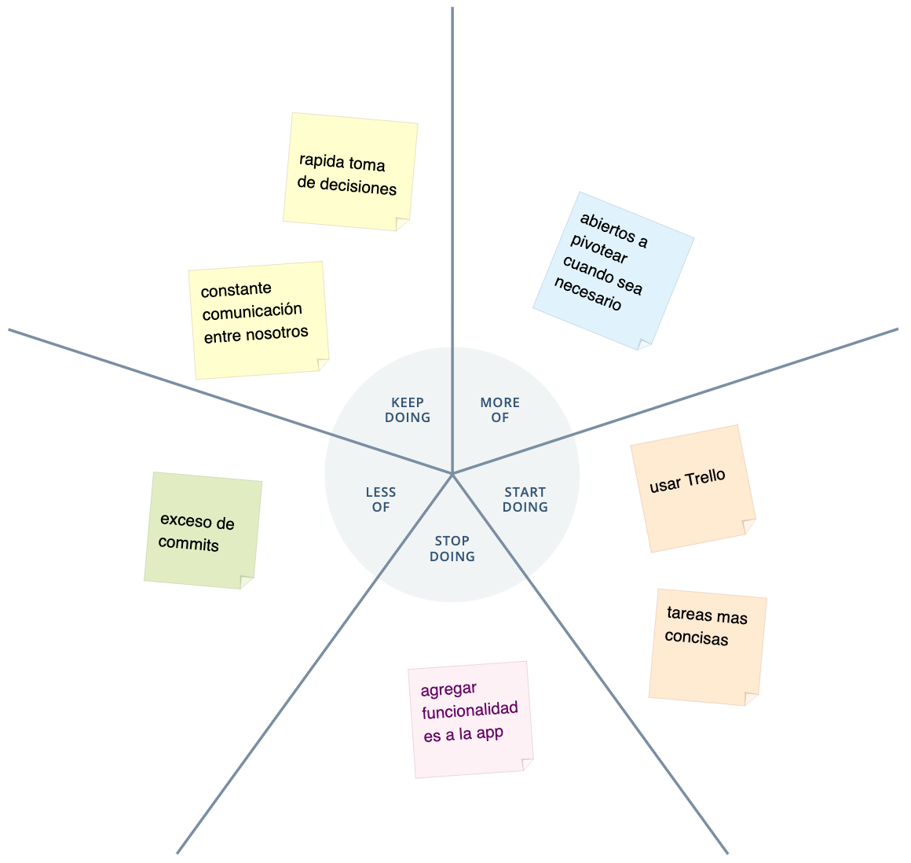

# Retrospectiva

  

  
  
  
El resultado del segundo sprint fue muy bueno ya que nos sirvió para realizar un pequeño pivot a la idea original. Dejó de ser una plataforma SaaS y se conviertió en un e-commerce con un nicho muy especifico. También nos sirvio para refactorizar el diseño de la app hacia un modelo mobile-first. El funcionamiento y la comunicación del equipo es muy buena y eso nos permite tomar decisiones rápidamente. Hay algunas cosas por mejorar como la división de tareas en porciones más concisas y disminuir el exceso de pequeños commits. 
