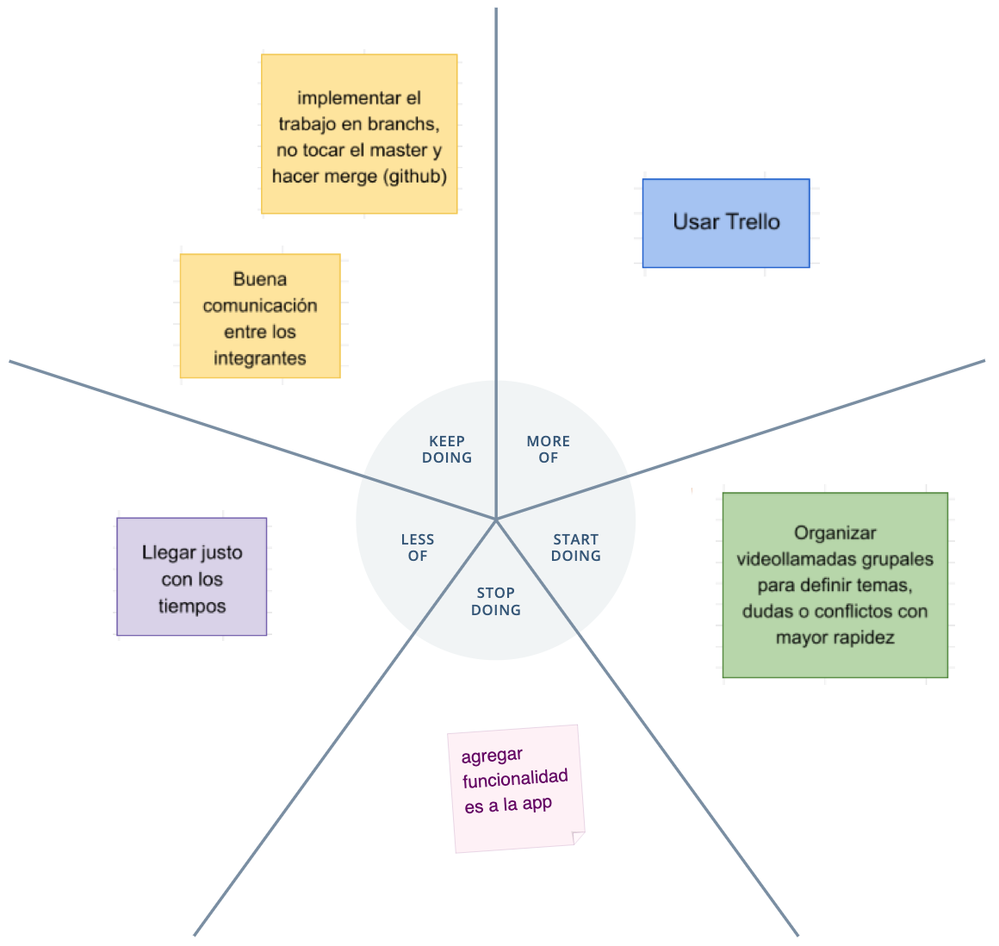

# Retrospectiva

- Un restaurante promedio tiene entre 15 y 20 proveedores diferentes.

- Cada proveedor tiene una vía diferente para recibir sus órdenes de
  compra (email, teléfono, WhatsApp, etc).

- Todos los días, al final del turno, el encargado de compras dedica, en
  promedio, una hora y cuarto a realizar los pedidos para el día siguiente.

- Al día siguiente, se vuelve a contactar al proveedor para asegurarse de
  que recibió correctamente la orden de compra.

